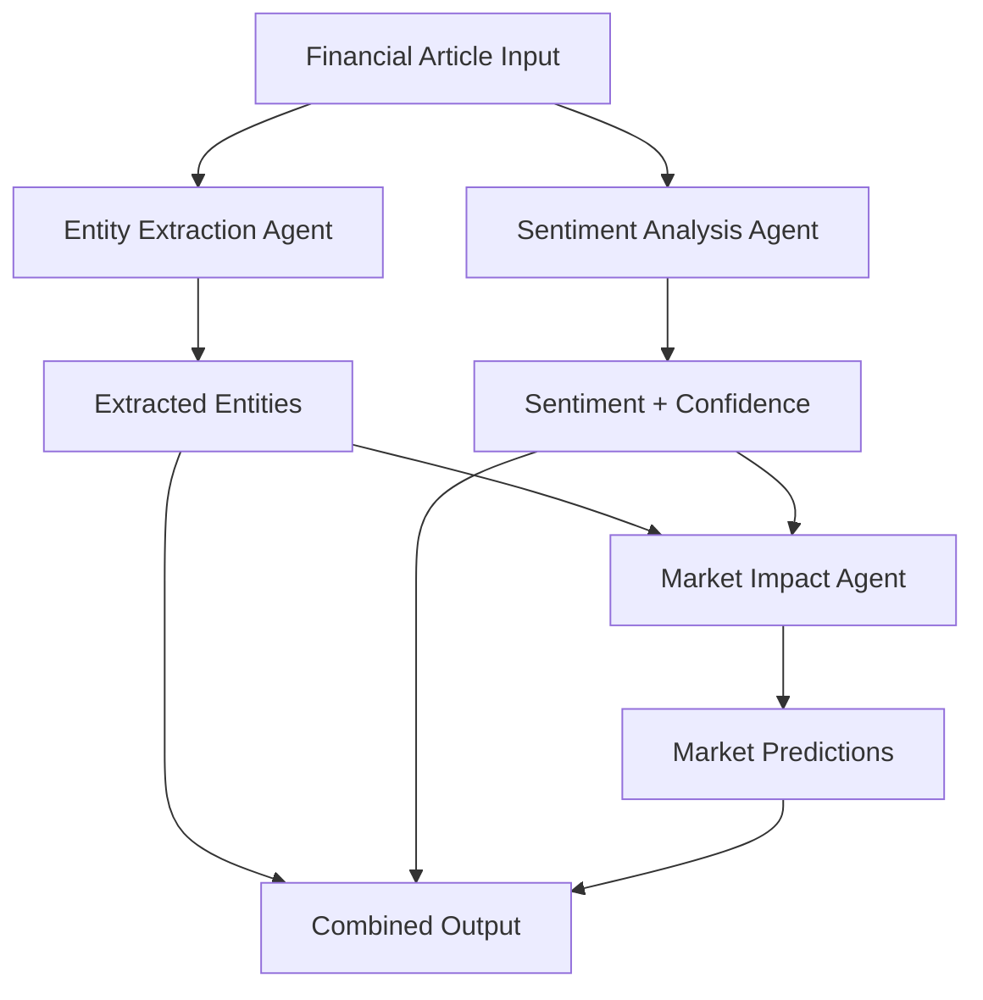

# System Architecture - Financial News Impact Analyzer

## Why Multiple Agents?

### The Multi-Agent Advantage

The decision to implement a multi-agent system rather than a single monolithic agent was driven by several key principles:

#### 1. **Separation of Concerns**
Each agent has a distinct, specialized responsibility:
- **Entity Agent**: Pure information extraction without interpretation
- **Sentiment Agent**: Emotional analysis without factual bias
- **Impact Agent**: Strategic synthesis without data collection burden

This separation ensures that each agent can be optimized for its specific task without compromising others.

#### 2. **Cognitive Load Distribution**
Financial news analysis involves multiple complex cognitive tasks:
- Pattern recognition (entities)
- Emotional interpretation (sentiment)
- Strategic reasoning (market impact)

By distributing these tasks, each agent can focus on excelling in its domain rather than being a "jack of all trades, master of none."

#### 3. **Independent Validation**
Having separate agents allows for:
- **Cross-validation**: Sentiment and entity extraction can validate each other
- **Bias reduction**: Each agent approaches the data with different perspectives
- **Error isolation**: Issues in one agent don't propagate to others

## Detailed Architecture

### Data Flow Architecture



### Agent Communication Protocol

#### Stage 1: Independent Analysis
```python
# Parallel execution for efficiency
entity_task = entity_extraction_agent(article).run(article)
sentiment_task = sentiment_analysis_agent(article).run(article)

# Both agents work independently on raw data
entity_result = await entity_task
sentiment_result = await sentiment_task
```

#### Stage 2: Data Synthesis
```python
# Market impact agent receives structured input
impact_context = {
    "headline": article["headline"],
    "content": article["content"],
    "sentiment": sentiment_result["sentiment"],
    "confidence_score": sentiment_result["confidence_score"],
    "sector": entity_result["sector"],
    "investment_usd": entity_result["investment_usd"]
}
```

#### Stage 3: Final Integration
The system combines all outputs into a unified response that maintains traceability to each agent's contribution.

### Agent Specialization Details

#### Entity Extraction Agent
**Core Function**: Factual data extraction without interpretation

**Design Philosophy**:
- Strict adherence to explicit information only
- No inference or assumption-making
- Structured output format for downstream processing

**Key Features**:
- Pattern matching for ticker symbols (e.g., "NASDAQ: TSLA")
- Numerical extraction for investment amounts
- Company name normalization

**Failure Modes & Handling**:
- Ambiguous company references → Returns most explicit match
- Missing ticker information → Returns null rather than guessing
- Unclear investment amounts → Extracts only clearly stated figures

#### Sentiment Analysis Agent
**Core Function**: Emotional tone analysis with confidence assessment

**Design Philosophy**:
- Focus on language patterns and emotional indicators
- Independent of factual content (can be positive about bad news if well-received)
- Confidence scoring to indicate certainty

**Key Features**:
- Context-aware sentiment analysis
- Market-specific language understanding
- Confidence calibration based on linguistic clarity

**Failure Modes & Handling**:
- Mixed sentiment signals → Defaults to neutral with low confidence
- Sarcasm or irony → Relies on explicit language patterns
- Technical jargon → Focuses on surrounding contextual language

#### Market Impact Agent
**Core Function**: Strategic synthesis and prediction

**Design Philosophy**:
- Combines multiple data sources for informed decisions
- Distinguishes between short-term and long-term effects
- Uses sector knowledge and investment scale for context

**Key Features**:
- Multi-factor analysis (sentiment + entities + sector)
- Temporal prediction (short vs. long term)
- Contextual reasoning (investment size matters)

**Decision Matrix**:
```
High Investment + Positive Sentiment + Growth Sector = Strong Positive
Low Investment + Negative Sentiment + Mature Sector = Mild Negative
No Investment + Neutral Sentiment + Any Sector = Neutral
```

## Inter-Agent Dependencies

### Forward Dependencies
1. **Entity → Impact**: Investment amounts and sectors inform market predictions
2. **Sentiment → Impact**: Emotional tone influences market psychology

### Validation Dependencies
1. **Entity ↔ Sentiment**: Cross-validation of company mentions
2. **All Agents → Output**: Consistency checking across predictions

### Error Propagation Prevention
- Each agent validates its own inputs
- Null values are explicitly handled rather than propagated
- Output validation ensures format consistency

## Scalability Considerations

### Horizontal Scaling
- Agents can run on separate processes/machines
- Async implementation allows for concurrent processing
- Stateless design enables easy replication

### Vertical Scaling
- Individual agents can be upgraded independently
- Model improvements don't require system-wide changes
- New agents can be added without modifying existing ones

### Performance Optimizations
- Parallel execution where possible
- Efficient JSON parsing and validation
- Minimal inter-agent communication overhead

## Alternative Architectures Considered

### Single Agent Approach
**Pros**: Simpler implementation, single point of optimization
**Cons**: Cognitive overload, harder to debug, single point of failure

**Why Rejected**: Financial analysis requires distinct skill sets that benefit from specialization

### Pipeline Architecture
**Pros**: Clear sequential flow, easy to understand
**Cons**: No parallelization, rigid execution order

**Why Modified**: We use pipeline for synthesis (impact agent) but parallel for independent tasks

### Microservices Architecture
**Pros**: Complete independence, language flexibility
**Cons**: Network overhead, complexity, harder testing

**Why Not Chosen**: Overkill for this use case, but our design could evolve this way

## Future Architecture Evolution

### Planned Enhancements
1. **Risk Assessment Agent**: Specialized in financial risk analysis
2. **Comparative Analysis Agent**: Compares similar companies/sectors
3. **Temporal Analysis Agent**: Analyzes trends over time

### Integration Patterns
- **Event-driven**: Agents respond to market events
- **Feedback loops**: Agents learn from prediction accuracy
- **Human-in-the-loop**: Expert validation and correction

## Technical Implementation Notes

### Model Configuration
- Single model configuration (`gemma3:1b`) for consistency
- Local Ollama deployment for speed and privacy
- Standardized prompt engineering across agents

### Error Handling Strategy
- Graceful degradation: Partial results better than complete failure
- Explicit null handling: Clear distinction between "unknown" and "not applicable"
- Validation at every step: Catch issues early in the pipeline

This architecture represents a thoughtful balance between specialization and integration, designed to handle the complex, multi-faceted nature of financial news analysis while maintaining simplicity and reliability.